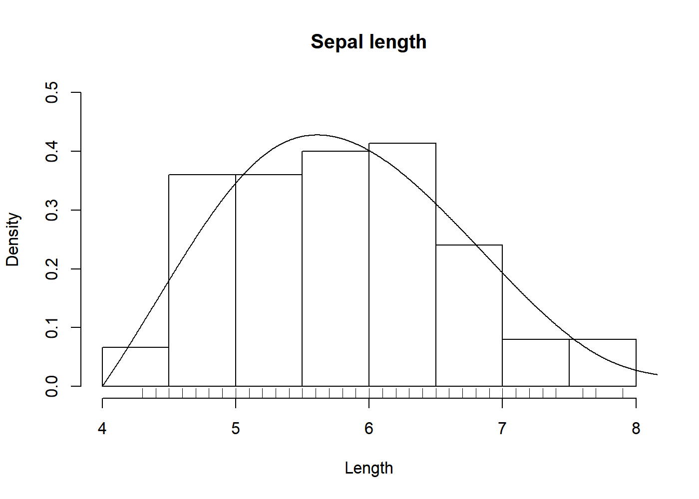

# polygrams 

<!-- badges: start -->

[](https://travis-ci.org/JonasMoss/polygrams)
[](https://ci.appveyor.com/project/JonasMoss/polygrams)
[](https://codecov.io/gh/JonasMoss/polygrams?branch=master)
[](https://www.repostatus.org/#wip)
<!-- badges: end -->

The `polygrams` package implements *Bernstein polygrams*, a class of
non-parametric density estimators for univariate densities on bounded
intervals.

**Note:** Bernstein polygrams are currently not described in detail
anywhere, but expect a paper on arXiv shortly.

## Installation

Install the package using `devtools` from inside `R`.

``` r
# install.packages("devtools")
devtools::install_github("JonasMoss/polygrams")
```

## Example Usage

The core function `polygram` calculates a Bernstein polygram from `x`.

``` r
library("polygrams")
#> Loading required package: Rcpp
#> Loading required package: RcppArmadillo
hist(iris$Sepal.Length, freq = FALSE, main = "Sepal length", xlab = "Length", ylim = c(0, 0.5))
lines(polygram(iris$Sepal.Length, support = c(4, 9), s = 3))
#> [1] 0.25 0.50 0.75
rug(iris$Sepal.Length)
```



## How to Contribute or Get Help

If you encounter a bug, have a feature request or need some help, open a
[Github issue](https://github.com/JonasMoss/polygrams/issues). Create a
pull requests to contribute. This project follows a [Contributor Code of
Conduct](https://www.contributor-covenant.org/version/1/4/code-of-conduct.md).
