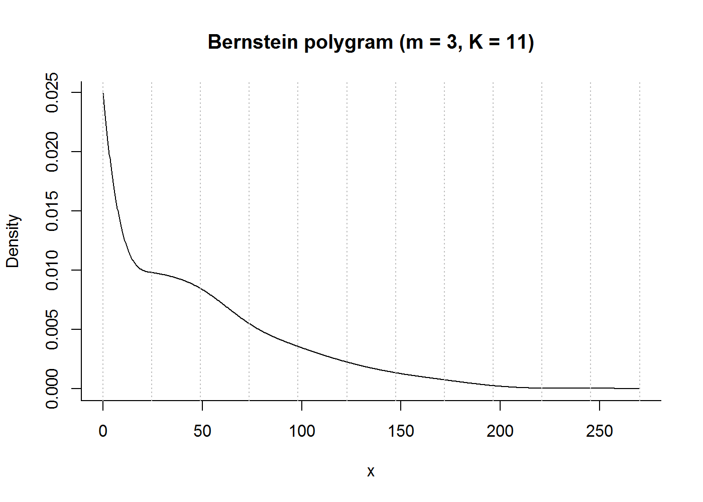

polygrams
================

The polygrams package includes function for handling of *Bernstein polygrams*, a class of non-parametric density estimators.

Installation
------------

From inside `R`, the package can be installed from GitHub by using devtools.

``` r
library("devtools")
install_github("JonasMoss/polygrams")
```

Usage
-----

The core function is `polygram`, which calculates a polygram based on the supplied `data`, which is its first argument. When `data` has supported different form \[0,1\], you should consider supplying it with the argument `support`. `s` specifies the positions of the split points, or number of split points if an integer. `m` specifies the degree of the Bernstein polynomials, and defaults to 3, while `p` specifies the degree of connectedness between adjacent bins.

For selecting `s`, the function `elbow_plot` is supplied. Generics such as `plot` should work well enough, and functions such as `dpolygram`, `ppolygram` and `rpolygram` work as well. The exception is `qpolygram` which hasn't been implemented yet.

For functionality such as shape constraints, check the documentation of `polygram`. For more information, type `??polygrams` in the `R` console.

Example usage
-------------

Load the library as is usually done.

``` r
library("polygrams")
```

As an application, we study the monthly sunspot data.

``` r
dat = datasets::sunspot.month
summary(dat)
```

    ##    Min. 1st Qu.  Median    Mean 3rd Qu.    Max. 
    ##    0.00   15.70   42.00   51.96   76.40  253.80

Based on the summary we choose the support \[0,270\]. Let's try |s| = 10:

``` r
plot(polygram(dat, support = c(0, 270), s = 10))
```



This density could be convex and monotone:

``` r
plot(polygram(dat, support = c(0, 270), s = 10, shape = "convex", monotone = "decreasing"))
```


